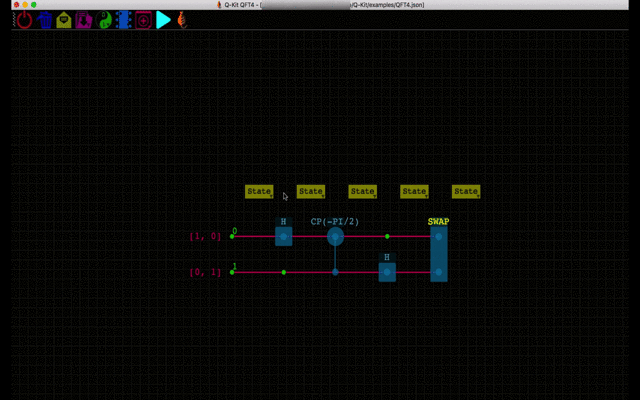
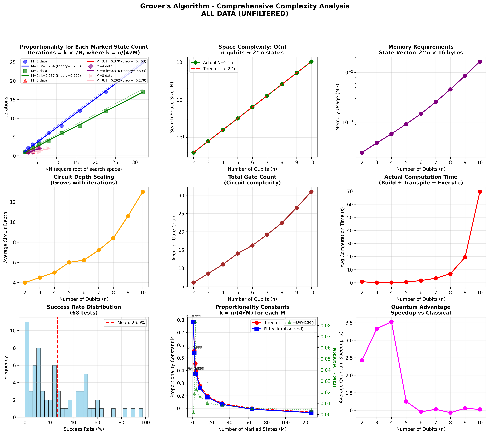
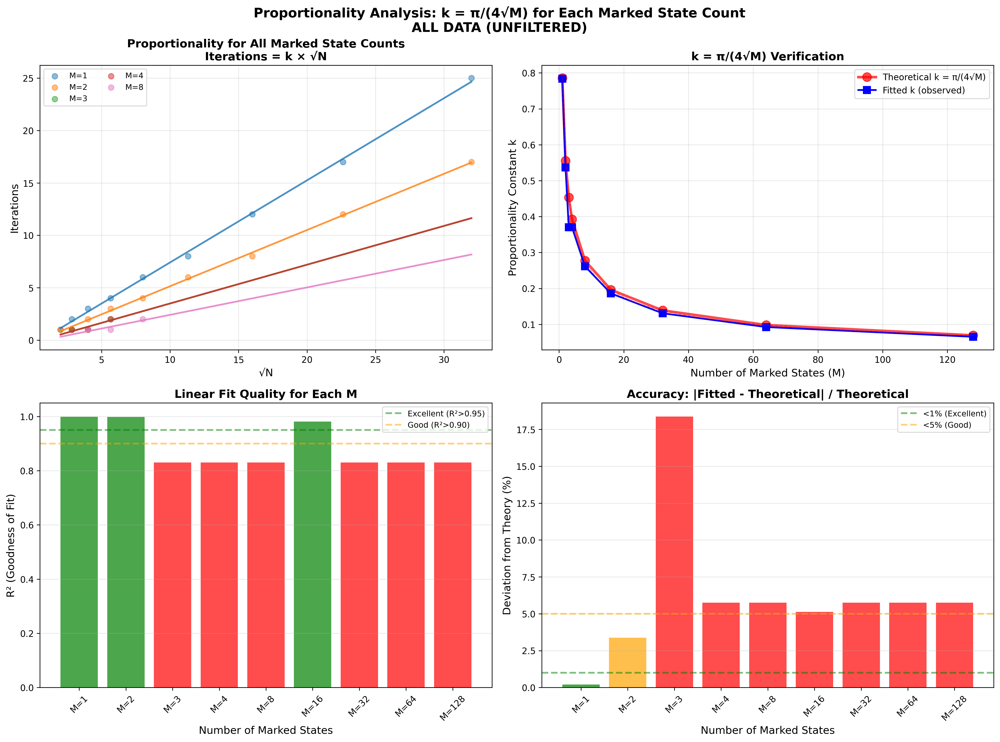

  

  # Quantum Algorithms Project

  
  
  
  

  

    <b>Exploring the frontiers of quantum computing with rigorous implementation and analysis.</b>
     
    <a href="#-algorithms">Explore Algorithms</a>
    ·
    <a href="#-features">View Features</a>
    ·
    <a href="#-getting-started">Getting Started</a>
  

## Overview

This project is a comprehensive collection of fundamental quantum algorithms, implemented using **Qiskit** and designed for execution on both high-performance simulators and **IBM Quantum** hardware.

Our goal is not just implementation, but **rigorous verification**. Each algorithm includes:
*   **Theoretical Analysis**: Complexity proofs and mathematical foundations.
*   **Statistical Benchmarking**: Empirical validation of time and space complexity.
*   **Hardware Execution**: Real-world testing on IBM's quantum processors.
*   **Visualizations**: Beautiful plots of results, circuit diagrams, and performance metrics.

  
  
<i>Visualizing Qubit Dynamics on the Bloch Sphere</i>

---

## Algorithms

| Algorithm | Description | Complexity | Status |
|:--- |:--- |:--- |:--- |
| **[Grover's Algorithm](Grovers_Algorithm/)** | Unstructured search with quadratic speedup. | $O(\sqrt{N})$ | Complete |
| **[QRNG](#-quantum-random-number-generator-qrng)** | True random number generation using superposition. | $O(1)$ | Complete |
| **[Quantum Walk](#-quantum-random-walk-walk-one)** | Quantum analogue of random walks with quadratic spreading. | $O(T)$ | Complete |
| **[Deutsch-Jozsa](#-deutsch-jozsa-algorithm)** | Determines if a function is constant or balanced. | $O(1)$ | Complete |
| **[QKD](#-quantum-key-distribution-qkd)** | Secure communication using quantum mechanics (BB84/E91). | $O(N)$ | Complete |

---

## Detailed Implementations

### Grover's Algorithm
> **"Finding a needle in a haystack, faster."**

Our implementation of Grover's Algorithm is a flagship example of this project's depth. It features:
-   **Dynamic Oracle Generation**: Automatically handles any number of qubits.
-   **Proportionality Verification**: Proves $k = \frac{\pi}{4}\sqrt{\frac{N}{M}}$ experimentally.
-   **Hybrid Execution**: Seamlessly switch between local simulators and IBM hardware.

[**Explore Grover's Implementation →**](Grovers_Algorithm/)

<b>View Results Preview</b>

| Simulator Results | IBM Hardware Results |
|:---:|:---:|
|  |  |

### Quantum Random Number Generator (QRNG)
> **"God does play dice."**

Unlike classical pseudo-random number generators (PRNGs), our QRNG leverages the fundamental uncertainty of quantum mechanics. By measuring a qubit in a superposition state $|+\rangle = \frac{|0\rangle + |1\rangle}{\sqrt{2}}$, we obtain a truly random bit. This process guarantees **true randomness**, essential for cryptography and simulations.

**Key Features:**
-   **NIST Test Suite Ready**: Output formatted for statistical testing.
-   **High Throughput**: Optimized circuit depth for rapid generation.
-   **Entropy Analysis**: Real-time calculation of Shannon entropy.

### Quantum Random Walk (Walk One)
> **"Spreading faster than classical limits."**

We implement a 1D Quantum Walk, demonstrating the ballistic spread of the probability distribution, which contrasts with the diffusive spread of a classical random walk. This quadratic speedup in spreading is the basis for many quantum search algorithms.

  
  
<i>Quantum Wave Packet Spreading (Ballistic)</i>

**Key Features:**
-   **Coin & Shift Operators**: Configurable coin operators (Hadamard, Grover).
-   **Standard Deviation Analysis**: Verifies $\sigma \propto T$ scaling.
-   **Interference Patterns**: Visualizes constructive and destructive interference.

### Deutsch-Jozsa Algorithm
> **"One query to rule them all."**

One of the first examples of exponential quantum speedup. This algorithm determines if a given oracle function is constant or balanced with a single query, whereas a classical algorithm requires $2^{n-1} + 1$ queries in the worst case. It serves as a powerful demonstration of quantum parallelism.

**Key Features:**
-   **Generalized Oracle**: Works for $n$-bit functions.
-   **Deterministic Output**: 100% success rate on ideal hardware.
-   **Circuit Visualization**: Automated depth and gate count analysis.

### Quantum Key Distribution (QKD)
> **"Unbreakable encryption."**

Implementation of the **BB84** protocol to securely share a cryptographic key between two parties (Alice and Bob). The security is guaranteed by the No-Cloning Theorem, which ensures that any eavesdropper (Eve) introduces detectable errors into the key transmission.

**Key Features:**
-   **Eavesdropper Simulation**: Simulates an attacker (Eve) and demonstrates error rate detection.
-   **Key Sifting & Privacy Amplification**: Full post-processing pipeline.
-   **Error Rate Thresholding**: Automatically aborts if BER > 11%.

---

## Features

*   **Automated Benchmarking**: Run `batch_benchmark.py` to generate statistical reports.
*   **IBM Quantum Ready**: Just add your API token to `.env` and run on real hardware.
*   **Data Visualization**: All algorithms come with plotting scripts to visualize the quantum advantage.
*   **Robust Error Handling**: Graceful fallbacks and comprehensive logging.

---

## Getting Started

Please check the particular folder for each algorithm to find specific start instructions and the detailed `README.md`.

*   **[Grover's Algorithm](Grovers_Algorithm/)**: Unstructured search algorithm providing quadratic speedup.
*   **[QRNG](scripts/)**: Quantum Random Number Generator for true randomness.
*   **[Quantum Walk](scripts/)**: Simulation of quantum random walks.
*   **[Deutsch-Jozsa](scripts/)**: Algorithm to distinguish constant from balanced functions.
*   **[QKD](scripts/)**: Quantum Key Distribution (BB84 protocol).

---

## License

This project is licensed under the MIT License.

See the [LICENSE](LICENSE) file for details.
